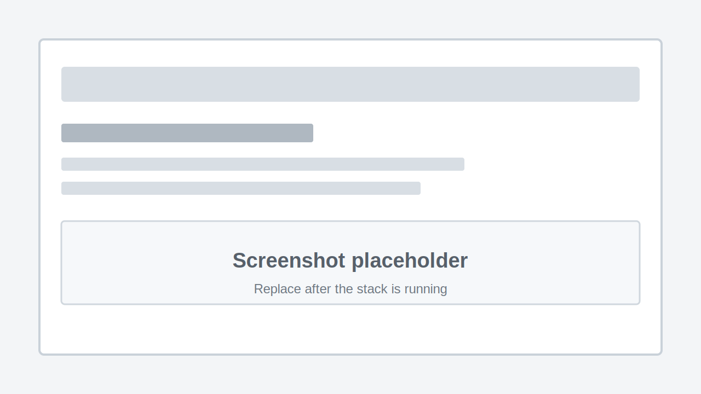

## Quick Arr Stack

Automated media stack for finding, downloading, organizing, subtitling, requesting, and watching movies and TV shows.

This version is built around:

- qBittorrent for torrent downloads
- a VPN sidecar container for qBittorrent traffic
- Prowlarr for indexers
- Sonarr, Radarr, and Lidarr for automation
- Bazarr for subtitles
- Jellyfin for playback
- Seerr for optional request management
- MusicSeerr for optional music request management

_Disclaimer: this repository is for educational and personal media-management use. Follow the laws and service terms that apply where you live._

## Table of Contents

- [Overview](#overview)
- [Architecture](#architecture)
- [Prerequisites](#prerequisites)
- [Environment](#environment)
- [Folders](#folders)
- [VPN Sidecar](#vpn-sidecar)
- [qBittorrent](#qbittorrent)
- [Jellyfin](#jellyfin)
- [Sonarr](#sonarr)
- [Radarr](#radarr)
- [Lidarr](#lidarr)
- [Prowlarr](#prowlarr)
- [FlareSolverr](#flaresolverr)
- [Bazarr](#bazarr)
- [Seerr](#seerr)
- [MusicSeerr](#musicseerr)
- [Testing](#testing)
- [Remote Access](#remote-access)
- [Useful Commands](#useful-commands)

## Overview

The stack uses a shared storage layout so every service sees the same paths. qBittorrent downloads into the shared media volume. Sonarr, Radarr, and Lidarr import completed downloads into organized library folders. Bazarr adds subtitles. Jellyfin scans the final library folders. Seerr and MusicSeerr provide request interfaces on top of Jellyfin and the matching automation apps.

Only qBittorrent is routed through the VPN sidecar. The other services stay on the normal Docker or host network so their web UIs and APIs remain easy to access from your LAN.

## Architecture

```text
Prowlarr -> Sonarr/Radarr/Lidarr -> qBittorrent -> VPN sidecar -> Internet
                                    |
                                    v
                           shared media storage
                                    |
                 Bazarr -> subtitles -> Jellyfin
                                    ^
                                    |
                         Seerr / MusicSeerr
```


## Prerequisites

- Docker
- Docker Compose
- A Linux host or NAS that can run Docker
- A storage location large enough for downloads and final media
- NordVPN manual OpenVPN service credentials
- An away-to-home VPN or other private remote-access method if you want to access the stack outside your LAN

Install Docker using the official Docker documentation for your platform, then verify it works:

```sh
docker run hello-world
```

## Environment

Copy the example environment file:

```sh
cp .env.example .env
```

Edit `.env` for your machine:

```sh
TZ=Europe/Lisbon
PUID=1000
PGID=1000
ROOT=/home/{youruser}
HDDSTORAGE=/home/{youruser}/Storage
LAN_NETWORK=192.168.1.0/24
```

Find your user and group IDs with:

```sh
id $USER
```

Set `LAN_NETWORK` to your home subnet, for example `192.168.1.0/24` or `192.168.68.0/24`. The VPN sidecar uses this to keep local web UI access working while qBittorrent traffic is routed through the VPN tunnel.

NordVPN credentials are not stored in `.env`. Put the OpenVPN config and auth file under:

```text
${ROOT}/MediaCenter/config/vpn
```

## Folders

Use one shared media root so qBittorrent, Sonarr, Radarr, Lidarr, Bazarr, and Jellyfin all agree on paths.

Expected storage layout:

```text
${HDDSTORAGE}/
  Downloads/
    movies/
    tv/
    music/
  Completed/
    Movies/
    TV/
    Music/
```

Create the shared download and final media folders:

```sh
mkdir -p \
  "${HDDSTORAGE}/Downloads/movies" \
  "${HDDSTORAGE}/Downloads/tv" \
  "${HDDSTORAGE}/Downloads/music" \
  "${HDDSTORAGE}/Completed/Movies" \
  "${HDDSTORAGE}/Completed/TV" \
  "${HDDSTORAGE}/Completed/Music"
```

If permissions are wrong, fix ownership for your config and storage roots:

```sh
sudo chown -R "$USER:$USER" /path/to/root-directory
sudo chown -R "$USER:$USER" /path/to/storage-directory
```

## VPN Sidecar

The `vpn` service runs an OpenVPN client. qBittorrent uses:

```yaml
network_mode: service:vpn
```

That means qBittorrent shares the VPN container network stack. qBittorrent traffic exits through the VPN tunnel, while services like Jellyfin, Sonarr, Radarr, Bazarr, Prowlarr, and Seerr stay reachable on the normal LAN paths.

NordVPN manual OpenVPN setup:

1. Log in to your Nord Account.
2. Open the NordVPN manual setup area.
3. Download a recommended OpenVPN UDP configuration file.
4. Get the NordVPN service credentials for manual connections.
5. Put the `.ovpn` file in `${ROOT}/MediaCenter/config/vpn`.
6. Put the service username and password in an auth file in the same folder.
7. Make sure the `.ovpn` file references that auth file with a container path, for example `auth-user-pass /vpn/vpn.auth`.

Start or restart the VPN service after changing files:

```sh
docker compose up -d vpn
docker compose logs -f vpn
```

The qBittorrent Web UI port is published through the VPN container:

```yaml
vpn:
  ports:
    - "8080:8080"
```

## qBittorrent

qBittorrent is the torrent client. It is intentionally attached to the VPN sidecar.

Compose service:

```yaml
qbittorrent:
  container_name: qbittorrent
  image: lscr.io/linuxserver/qbittorrent:latest
  restart: unless-stopped
  environment:
    - PUID=${PUID}
    - PGID=${PGID}
    - TZ=${TZ}
    - WEBUI_PORT=8080
  volumes:
    - ${ROOT}/MediaCenter/config/qbittorrent:/config
    - ${HDDSTORAGE}:/MediaCenterBox
  network_mode: service:vpn
  depends_on:
    - vpn
```

Start it with the VPN:

```sh
docker compose up -d vpn qbittorrent
```

Open the Web UI:

```text
http://localhost:8080
```

The LinuxServer qBittorrent image prints the temporary `admin` password in the container logs on first startup. Change the Web UI username and password after logging in.

```sh
docker compose logs qbittorrent
```

Recommended qBittorrent settings:

- Set completed downloads to a path under `/MediaCenterBox/Downloads`.
- Use categories for `movies`, `tv`, and `music` if you want cleaner Sonarr, Radarr, and Lidarr routing.
- Do not configure SOCKS5 for the first pass; verify the VPN-only path first.



_Screenshot placeholder: replace this with the qBittorrent Web UI and settings after validation._

## Jellyfin

Jellyfin is the media server. It reads the final imported folders and does not need to run behind the VPN sidecar.

Open the Web UI:

```text
http://localhost:8096
```

Add libraries:

- Movies: `/MediaCenterBox/Movies`
- TV Shows: `/MediaCenterBox/TV`
- Music: `/MediaCenterBox/Music`

Those paths correspond to the host folders:

```text
${HDDSTORAGE}/Completed/Movies
${HDDSTORAGE}/Completed/TV
${HDDSTORAGE}/Completed/Music
```


_Screenshot placeholder: replace this with the Jellyfin library setup after validation._

## Sonarr

Sonarr manages TV shows.

Open the Web UI:

```text
http://localhost:8989
```

Set the root folder:

```text
/MediaCenterBox/Completed/TV
```

Add qBittorrent as the download client:

- Host: `vpn`
- Port: `8080`
- Username/password: the qBittorrent Web UI credentials
- Category: `tv`

Enable completed download handling so Sonarr imports completed episodes into the TV library folder.


_Screenshot placeholder: replace this with Sonarr qBittorrent download-client settings after validation._

## Radarr

Radarr manages movies.

Open the Web UI:

```text
http://localhost:7878
```

Set the root folder:

```text
/MediaCenterBox/Completed/Movies
```

Add qBittorrent as the download client:

- Host: `vpn`
- Port: `8080`
- Username/password: the qBittorrent Web UI credentials
- Category: `movies`

Enable completed download handling so Radarr imports completed movies into the Movies library folder.


_Screenshot placeholder: replace this with Radarr qBittorrent download-client settings after validation._

## Lidarr

Lidarr manages music.

Open the Web UI:

```text
http://localhost:8686
```

Set the root folder:

```text
/MediaCenterBox/Completed/Music
```

Add qBittorrent as the download client:

- Host: `vpn`
- Port: `8080`
- Username/password: the qBittorrent Web UI credentials
- Category: `music`

Add music-capable indexers through Prowlarr and let Prowlarr sync them into Lidarr.


_Screenshot placeholder: replace this with Lidarr download-client and root-folder settings after validation._

## Prowlarr

Prowlarr manages torrent indexers and syncs them to Sonarr, Radarr, and Lidarr.

Open the Web UI:

```text
http://localhost:9696
```

Add indexers in Prowlarr, then add Sonarr, Radarr, and Lidarr as apps. You will need each app API key from its `Settings` -> `General` area.

Prowlarr does not need to run behind the VPN sidecar in this stack. It only needs to reach indexers and the Sonarr/Radarr APIs.


_Screenshot placeholder: replace this with Prowlarr app/indexer settings after validation._

## FlareSolverr

FlareSolverr is optional. Keep it if your chosen indexers need Cloudflare challenge handling.

Open service port:

```text
http://localhost:8191
```

Configure it in Prowlarr under indexer proxy settings when needed:

- Name: `FlareSolverr`
- Host: `http://flaresolverr:8191`
- Request timeout: `60`

## Bazarr

Bazarr manages subtitles for Sonarr and Radarr media.

Open the Web UI:

```text
http://localhost:6767
```

Configure:

- Preferred subtitle languages
- Subtitle providers
- Sonarr integration with the Sonarr API key
- Radarr integration with the Radarr API key

Bazarr uses the same media mount as Sonarr and Radarr:

```text
/MediaCenterBox
```


_Screenshot placeholder: replace this with Bazarr integration settings after validation._

## Seerr

Seerr is optional request and discovery management for Jellyfin, Sonarr, and Radarr.

Open the Web UI:

```text
http://localhost:5055
```

Configure:

- Jellyfin as the media server
- Sonarr as the TV request target
- Radarr as the movie request target
- Default quality profiles and root folders
- API keys for Sonarr and Radarr


_Screenshot placeholder: replace this with Seerr Jellyfin/Sonarr/Radarr setup after validation._

## MusicSeerr

MusicSeerr is optional request and discovery management for Jellyfin and Lidarr.

Open the Web UI:

```text
http://localhost:8688
```

Configure:

- Lidarr as the music request target
- Jellyfin if you want media-server integration
- Default quality profiles and root folder through Lidarr

MusicSeerr depends on MusicBrainz coverage for best results. Missing Spotify releases may need manual MusicBrainz imports before they become easy to request.


_Screenshot placeholder: replace this with MusicSeerr setup after validation._

## Testing

Static validation:

```sh
docker compose --env-file .env.example config
docker compose --env-file .env.example config --services
```

Start non-VPN services after `.env` points to real local paths:

```sh
docker compose up -d jellyfin prowlarr sonarr radarr lidarr bazarr flaresolverr seerr musicseerr
```

Start the VPN path after NordVPN OpenVPN files are in place:

```sh
docker compose up -d vpn qbittorrent
docker compose logs -f vpn
docker compose logs qbittorrent
```

VPN validation:

- Open qBittorrent at `http://localhost:8080`.
- Add a torrent IP-check magnet.
- Confirm the reported torrent IP is a NordVPN exit IP, not your home ISP IP.

End-to-end validation:

1. Add a public-domain test movie in Radarr.
2. Confirm Radarr sends it to qBittorrent.
3. Confirm qBittorrent downloads through the VPN path.
4. Confirm Radarr imports it under `/MediaCenterBox/Completed/Movies`.
5. Confirm Jellyfin displays it in the Movies library.
6. Confirm Bazarr sees the imported media.
7. Confirm Lidarr and MusicSeerr can request and import a test album.


_Screenshot placeholder: replace this with the qBittorrent and Jellyfin test results after validation._

## Remote Access

This stack does not include a remote-access VPN container.

Use your existing away-to-home VPN to join your home network first. After that, access the same LAN service URLs you use at home:

```text
Jellyfin:     http://SERVER-IP:8096
qBittorrent: http://SERVER-IP:8080
Prowlarr:    http://SERVER-IP:9696
Sonarr:      http://SERVER-IP:8989
Radarr:      http://SERVER-IP:7878
Lidarr:      http://SERVER-IP:8686
Bazarr:      http://SERVER-IP:6767
Seerr:       http://SERVER-IP:5055
MusicSeerr:  http://SERVER-IP:8688
```

Avoid exposing these web UIs directly to the public internet.

## Useful Commands

Check running containers:

```sh
docker container ls --format "{{.Names}} || state {{.State}} {{.Status}} || ID {{.ID}}"
```

Start the stack:

```sh
docker compose up -d
```

Restart one service:

```sh
docker compose restart SERVICE_NAME
```

Follow logs:

```sh
docker compose logs -f SERVICE_NAME
```

Update images:

```sh
docker compose pull
docker compose up -d
```

## Thanks

[](https://www.buymeacoffee.com/rick45)

## Star History

[](https://www.star-history.com/#Rick45/quick-arr-Stack&Date)
